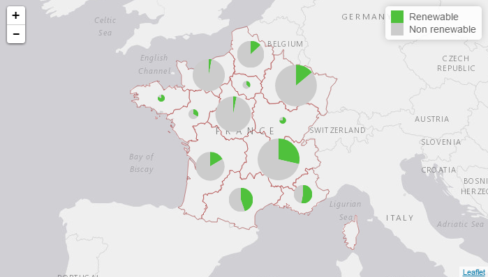
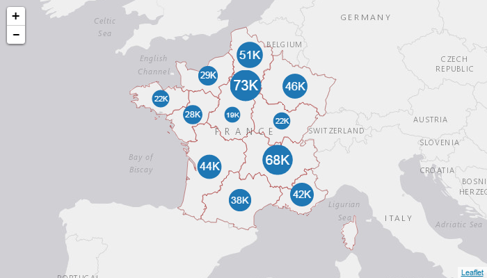

[](https://cran.r-project.org/package=leaflet.minicharts)
[](http://cran.r-project.org/package=leaflet.minicharts)
[](https://travis-ci.org/rte-antares-rpackage/leaflet.minicharts)
[](https://ci.appveyor.com/project/rte-antares-rpackage/leaflet-minicharts)
[](https://codecov.io/github/rte-antares-rpackage/leaflet.minicharts?branch=master)

# Minicharts for Interactive Maps

For a few years now, it has become easy to create interactive maps with R thanks to the package `leaflet` by the Rstudio team. Nevertheless, it only provides only a few functions to create basic shapes on a map, so the information that can be represented on a single map is limited: if you have some data associated to some points, you can only represent at most two variables by drawing circles and changing their radius and color according to data.

`leaflet.minicharts` is an R package that provides two functions to add and update small charts on an interactive maps created with the package `leaflet`. These charts can be used to represent as many variables as desired associated to geographical points. Currently, three types of chart are supported: barcharts (the default), pie charts and polar area charts.

Here are screenshots of sample outputs:





You can also find a [live example here](https://francoisguillem.shinyapps.io/shiny-demo/).

## Installation and usage

You can install the package from CRAN:

```r
install.packages("leaflet.minicharts")
```

To see how simple it is to use this package, have a look at the [package vignette](https://cran.r-project.org/web/packages/leaflet.minicharts/vignettes/introduction.html).

## Contributing:

Contributions to the library are welcome and can be submitted in the form of pull requests to this repository.

This package contains some javascript code. To modify it requires `npm` and `grunt`. First modify files in the `javascript` folder. Then in a terminal, run the following commands:

```
cd javascript
npm install
grunt build
```

## License Information:

Copyright 2015-2018 RTE (France)

* RTE: http://www.rte-france.com

This Source Code is subject to the terms of the GNU General Public License, version 2 or any higher version. If a copy of the GPL-v2 was not distributed with this file, You can obtain one at https://www.gnu.org/licenses/old-licenses/gpl-2.0.en.html.
